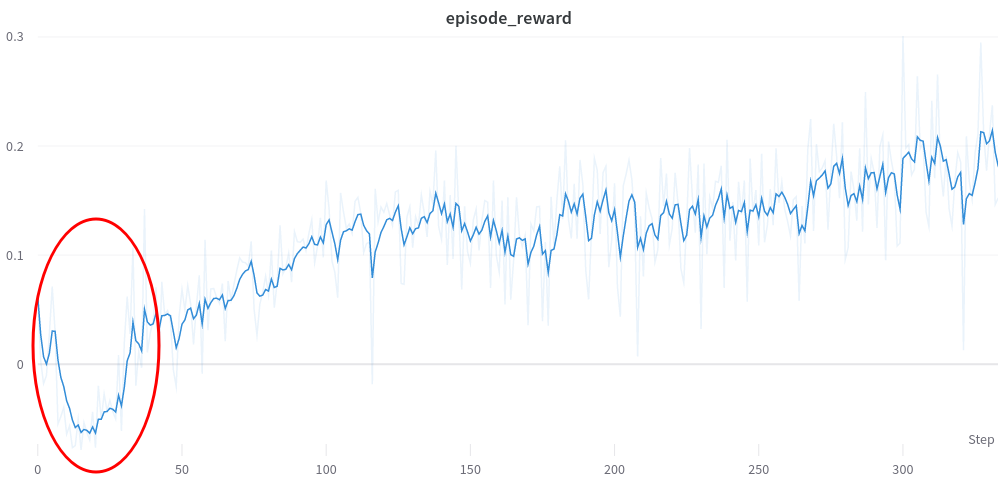
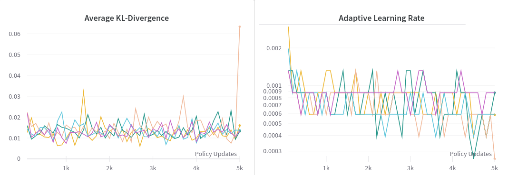

<!-- This article is not an introduction for reinforcement learning and assumes you know what it is and are trying to get into it. -->

<!-- Outline of this post
1. RL is a very exciting and promising field
2. BUT its hard to reproduce results and hard to apply to new fields
3. This blog post gives a list of tricks and lessons learned for beginners trying to write RL algorithms from scratch and/or apply RL algorithms to new tasks -->
<!--
The list of tricks -->
<!--
First of all, it is difficult to reproduce results in deep reinforcement learning ([Wired article](https://www.wired.com/story/artificial-intelligence-confronts-reproducibility-crisis/)). -->

<!-- Reinforcement Learning is a category in machine learning that doesn't quite fall under the scope of supervised or unsupervised learning -->

<!-- *Update 9/15/2022: Experimental results coming soon!* -->

When I first started studying reinforcement learning (RL), I implemented [Proximal Policy Optimization (PPO)](https://arxiv.org/abs/1707.06347) from scratch using only the [psuedocode](https://spinningup.openai.com/en/latest/algorithms/ppo.html#pseudocode) on OpenAI's website. It didn't work and failed to obtain nearly any reward on most OpenAI Gym environments. It took a few more months of debugging, reading other RL implementations, and talking to colleagues to get things working. My conversations with other Georgia Tech students revealed that initially struggling to do basic things with RL was not uncommon. [These](https://www.alexirpan.com/2018/02/14/rl-hard.html#:~:text=Often%2C%20it%20doesn't%2C,out%20of%20the%20RL%20algorithm.) blog [posts](https://andyljones.com/posts/rl-debugging.html) do a great job of explaining the difficulty with RL and really resonate with my own experiences.

<!-- Some of these "tricks" are will be obvious if you have experience in supervised learning, such as gradient clipping and input normalization.  -->

<!-- These are all things that are very important to getting this working, but are mundane enough that most of the time no one really tells you explicitly to make sure to do these things or they assume that you already know.  -->

<!-- Where possible, I have tried to include links to code in RL implementations where these tricks are found. I will additionally include a link to any help Pytorch functions for implementation. -->

In hindsight, there was no single major flaw with my initial PPO implementation, but rather many small tricks and optimizations that were missing. The purpose of this post is to enumerate these tricks and provide references to code where they are implemented. They are roughly ordered in descending order of importance. Knowledge of some of these tricks is only necessary if you are implementing an RL algorithm from scratch, as most public implementations will already include them. However, knowing of their existence will enable you to debug more effectively and make changes more intelligently.

Different RL implementations will include a slightly different set of tricks. As evidence of their importance, check out this figure (below) from the paper [Deep Reinforcement Learning that Matters](https://arxiv.org/pdf/1709.06560.pdf). The authors show empirically that different popular implementions of the same RL algorithm differ significantly in performance on standard RL benchmarks, even when controlling for hyperparameters and network architecture.

<!-- (They also expose a similar sensitivity to hyperparameters, network architecture, random seed, reward scale, and choice of environment -- RL is very finicky). -->

<!-- Different implementations include different sets of tricks -- and they really do make a difference. In -->

<!-- Through the entire process, I learned of a variety of small tricks and optimizations that are typically used to get RL algorithms working on complex environments. -->
<!-- I believe the different set of tricks included in each implementation is the primary cause of this inconsistency. Additionally, many of these tricks introduce their own hyperparameters. -->

<!-- Deep reinforcement learning (RL) is an exiciting area of study, but it can be difficult to [reproduce results](https://www.wired.com/story/artificial-intelligence-confronts-reproducibility-crisis/) in academic papers or successfully apply RL algorithms to new domains. Part of the issue is learning all the small tricks which are sometimes not disclosed and vary between impelemtations. -->

<em>Figure 6 from [Deep Reinforcement Learning that Matters](https://arxiv.org/pdf/1709.06560.pdf), plotting the performance of different RL implementations averaged over 5 random seeds. These variations can be explained by differences in implementation and different PyTorch/TF versions.</em>

 <!-- When I started in 2020, I had been motivated by cool results [in](https://openai.com/blog/learning-dexterity/) [robotics](https://arxiv.org/pdf/1812.11103.pdf and [video games](https://arxiv.org/pdf/1312.5602). The generality and power of deep RL algorithms seemed very promising compared to the domain-specific trajectory optimization algorithms for robotic locomotion that I had been previously studying. -->

<!-- However, in doing RL research I quickly found that it was difficult to reproduce existing results or to apply RL to new tasks. -->

<!-- I began studying reinforcement learning (RL) in the summer of 2020, when I joined the [Robotics Perception and Learning Lab](https://faculty.cc.gatech.edu/~zk15/). I was motivated by the how powerful and general the algorithms seemed and the results in [video games](https://arxiv.org/pdf/1312.5602) and especially in [robotics](https://arxiv.org/pdf/1812.11103.pdf) [Shadow Hand](https://openai.com/blog/learning-dexterity/). -->

<!-- However, while it is trivial to clone a popular RL repository and train policies on existing benchmarks, implementing RL algorithms from scratch or succesfully applying RL to a new task or application domain is quite difficult. Reading academic papers and understand the theory behind why an algorithm works is an important part of research, but not enough for .

My issue was that even if I understood all the theory behind an RL algorithm, either from a paper or from Spinning Up, there were still many tricks required to get RL working in practice. To draw a parallel to supervised learning, it would be like understanding SGD and neural networks, but not having knowledge of batch norms or residual connections.

Altough PPO is a SOTA algorithm, implementing pseudocode directly from the PPO paper (below) will not yeild SOTA performance. You need all the other stuff. -->

Now for some disclaimers -- nearly all of my experience comes from training on-policy algorithms for continuous control, so there may be useful tips for discrete/off-policy settings that I'm missing. Also, RL is a super-hot field and perhaps some of the content in this post is already outdated. Hopefully, this blog is at least useful to someone starting out like I was. Please don't hesitate to reach out to me if you think there is something important missing!

Most of the examples will come from either of these two RL implementations:
- [pytorch-a2c-ppo-acktr-gail](https://github.com/ikostrikov/pytorch-a2c-ppo-acktr-gail)
- [RL Games](https://github.com/Denys88/rl_games)

<!-- I don't have ablation results on all of these. -->

<!-- ### Using an existing RL Implementation and environment -->

Implementing an RL algorithm from scratch is an excellent way to learn. However, if you just need to get something working quickly, you should instead just fork a popular repo and start from there. Here are some suggestions:

- [Stable Baselines3](https://stable-baselines3.readthedocs.io/en/master/)
- [RL Games](https://github.com/Denys88/rl_games)
- [pytorch-a2c-ppo-acktr](https://github.com/ikostrikov/pytorch-a2c-ppo-acktr-gail)
- [RLlib](https://docs.ray.io/en/latest/rllib/index.html)
<!-- This is the main thing you should do instead of trying to code one from scratch. Take an existing implementation, play around with it, run some benchmarks. Then make a fork and start modifying the implementation for your own project. They will include their own set of tricks, and the creators have likely already tuned it a lot on RL benchmarks and provide default hyperparameter values that work decently well. -->

<!-- TODO post this on the RL discord. -->

Contents:
- [Observation and Normalization Clipping](#observation-normalization-and-clipping)
- [Dense Rewards](#dense-rewards)
- [Hyperparameter Tuning](#hyperparameter-tuning)
- [Gradient Normalization and Clipping](#gradient-normalization-and-clipping)
- [Reward Normalization and Clipping](#reward-normalization-and-clipping)
- [Advantage Standardization](#advantage-standardization)
- [Bootstrapping Incomplete Episodes](#bootstrapping-incomplete-episodes)
- [Generalized Advantage Estimation](#generalized-advantage-estimation)
- [Entropy Decay](#entropy-decay)
- [Value Network Loss Clipping](#value-network-loss-clipping)
- [Learning Rate Scheduling](#learning-rate-scheduling)

Thanks to [Andrew Szot](https://www.andrewszot.com/) and [Mathew Piotrowicz](https://www.linkedin.com/in/mathew-piotrowicz-aa4962137/) for reading drafts of this and providing feedback.

### Observation Normalization and Clipping

In RL, the inputs to the policy and value networks are observations, which can consist of values that differ by orders of magnitude. For example, if you are learning a policy to control a robot, your observation could contain joint angles ranging from $ -\frac{\pi}{2} $ to $ \frac{\pi}{2} $ radians and a robot position coordinate that lies between 0 and 1000 meters. Normalizing the input space to eliminate this difference in scale leads to more stable training and faster convergence. This should be nothing new to those with prior experience training neural networks.

The two most common methods for preprocessing are standardization and rescaling. Standardization refers to subtracting the mean and dividing by the standard deviation of the data so that each dimension approximates a standard normal distribution. Rescaling means mapping the data to the range $ \left[0, 1\right] $ by subtacting the min and dividing by the range. In either case, clipping should also be applied after normalization. Neural networks are bad at extrapolation, and outliers can produce unexpected outputs. In my work, observations are clipped to $[-5.0, 5.0]$ after standardization.

In supervised learning, statistics calculated over the training set are used to normalize each sample. In RL, this isn't possible because the dataset (consisting of interactions with the environment) is collected online and the statistics change continuously. Because of this, you need to calculate an online mean and standard deviation. Most RL codebases use an implementation of [Welford's Online Algorithm](https://en.wikipedia.org/wiki/Algorithms_for_calculating_variance#Welford's_online_algorithm) like [this one](https://github.com/DLR-RM/stable-baselines3/blob/master/stable_baselines3/common/running_mean_std.py) from Stable Baselines3.

This online approach is best when your algorithm needs to work on many different environments. However, it often causes an initial drop in performance (red circle below) as the mean and standard deviation move rapidly early in training due a small sample size and exploration.

*An initial drop in performance caused by normalization statistics moving faster than the policy updates.*
<!-- Do this because optimization is much more effective when the different inputs are all the same scale, speeds up learning, and leads to faster convergence. Also avoid clipping to get rid of random or unexpected outliers, and because neural networks are bad at extrapolating. -->

Alternatively, if you have good prior knowledge about the bounds of the observation space, you can just rescale your data to the range [-1, 1] or [0, 1], like what they do [here](https://github.com/leggedrobotics/legged_gym/blob/dd6a6892e54c4f111a203319c05da8dca9595ae1/legged_gym/envs/base/legged_robot.py#L212).

<!-- That way you avoid computing an online mean and the warmup period. This may also be more stable wrt random seed, get out of local minima easier -->

<!-- Neural networks like nice smooth inputs and outputs. -->
**Note:** A common bug when replaying trained policies is the failure to save and load normalization statistics. A policy network will not work during test time if the inputs are not preprocessed the same way they were during training.

Code examples
- [RL Games 1](https://github.com/Denys88/rl_games/blob/06a3319d3a6af566d984aa5953b1fd7a24a8e3a4/rl_games/common/a2c_common.py#L587)
- [RL Games 2](https://github.com/Denys88/rl_games/blob/94e55563be60f10e659428cdce7b4e0bd131d471/rl_games/algos_torch/models.py#L41)
- [pytorch-a2c-ppo-acktr-gail](https://github.com/ikostrikov/pytorch-a2c-ppo-acktr-gail/blob/41332b78dfb50321c29bade65f9d244387f68a60/a2c_ppo_acktr/envs.py#L193)

<!-- ### Simplify the action space and add prior knowedge
PMTG, foot position instead of joints to avoid learning IK, make the outputs just deltas to a expert policy
 -->

### Dense Rewards

<!-- (dense = every timestep, smooth = varies smoothly between regions of the state space (ie gradual change vs large steps)) -->

This tip will only be applicable if you are applying RL to a new task where you have the freedom to specify a reward function, rather than training on standard RL benchmarks where the reward function is part of the task.

Sparse rewards are difficult for RL algorithms to learn from. If possible, try making your reward *dense*, meaning that at every timestep the agent recieves an informantive reward as a function of the current state, previous state, and action taken. For example, instead of rewarding an agent +1.0 for reaching a goal and 0.0 otherwise, try giving a reward at every timestep that is propotional to progress towards the goal. Of course, this requires some prior knowledge of what progress looks like and can limit the types of solutions that your policy discovers.

<em>Figure 3 from [ALLSTEPS: Curriculum-driven Learning of Stepping Stone Skills](https://arxiv.org/abs/2005.04323) depicting the stepping-stone task</em>

For example, in the paper [ALLSTEPS: Curriculum-driven Learning of Stepping Stone Skills](https://arxiv.org/abs/2005.04323), the authors train a bipedal robot to hit a series of stepping stones. A naive reward design would give +1.0 if the robot's foot hit the center of the foot target (depicted above), and 0.0 otherwise. Instead of doing this, the authors specify a reward function of

$$ r_{target} = k_{target}\exp(-d/k_d) $$

where $d$ is the distance from the foot to the target, and $ k_{target}$ and $k_d$ are hyperparameters. If the robot's foot makes any contact with the stepping stone, it receives a reward. The closer the foot is to the center of the block, the higher the reward. The authors explain:

>In the initial stages of training, when the character makes contact with the target, the contact location may be far away from the center. Consequently, the gradient with respect to the target reward is large due to the exponential, which encourages the policy to move the foot closer to the center in the subsequent training iterations.

Without the dense reward, there would be no reward gradient across the state space, which makes learning more difficult.

### Hyperparameter Tuning
RL is notoriously sensitive to hyperparameters and there is no one-size-fits-all for good hyperparameter values. Typically, different implementations and different applications will require different hyperparameters. Here are just a few hyperparameters that could make a difference:

- reward function term coefficients
- number of policy updates and samples per update
- learning rate
- entropy coefficient
- value coefficient
- network architecture
- batch size and number of epochs per policy update
- clipping values for gradients, rewards, values, observations, and the PPO loss

The good thing is [Weights & Biases](https://docs.wandb.ai/guides/sweeps) has a powerful pipeline for automated, distributed hyperparameter sweeps. They support random search, grid search, and Bayesian search.

### Gradient Normalization and Clipping
This is another one that could be obvious if you have a background in deep learning already. Normalizing the gradient of the value and policy networks after each backward pass can help avoid numerical overflow, exploding gradients, or destructively large parameter updates. Other tricks for avoiding these same issues include reward normalization and clipping, value function loss clipping, and advantage standardization.

Code examples:
- [RL Games](https://github.com/Denys88/rl_games/blob/8da6852f72bdbe867bf12f792b00df944b419c43/rl_games/common/a2c_common.py#L252)
- [pytorch-a2c-ppo-acktr-gail](https://github.com/ikostrikov/pytorch-a2c-ppo-acktr-gail/blob/efc71f600a2dca38e188f18ca85b654b37efd9d2/a2c_ppo_acktr/algo/ppo.py#L82)
- [torch.nn.utils.clip_grad_norm_](https://pytorch.org/docs/stable/generated/torch.nn.utils.clip_grad_norm_.html)
- [torch.nn.utils.clip_grad_value_](https://pytorch.org/docs/stable/generated/torch.nn.utils.clip_grad_value_.html)

### Reward Normalization and Clipping
Typically, it is best not to have reward values that differ by many orders of magnitude. For example, in the paper [Playing Atari with Deep Reinforcement Learning](https://www.cs.toronto.edu/~vmnih/docs/dqn.pdf), the authors clip all rewards to the range $ \left[-1, 1\right] $.

>Since the scale of scores varies greatly from game to game, we fixed all positive rewards to be 1 and all negative rewards to be −1, leaving 0 rewards unchanged. Clipping the rewards in this manner limits the scale of the error derivatives and makes it easier to use the same learning rate across multiple games. At the same time, it could affect the performance of our agent since it cannot differentiate between rewards of different magnitude.
 
>-- <cite>Mnih, Volodymyr, Koray Kavukcuoglu, David Silver, Alex Graves, Ioannis Antonoglou, Daan Wierstra, and Martin Riedmiller. "Playing atari with deep reinforcement learning." arXiv preprint arXiv:1312.5602 (2013).</cite>

In addition to just clipping the rewards, you can also keep a running mean and standard deviations of rewards to standardize rewards or returns (discounted rewards).

Code examples:
- [pytorch-a2c-ppo-acktr-gail](https://github.com/ikostrikov/pytorch-a2c-ppo-acktr-gail/blob/efc71f600a2dca38e188f18ca85b654b37efd9d2/a2c_ppo_acktr/model.py)
    - Rewards are processed by these two environment wrappers from Stable Baselines3
    - [stable_baselines3.common.atari_wrappers.ClipRewardEnv](https://stable-baselines3.readthedocs.io/en/master/common/atari_wrappers.html#stable_baselines3.common.atari_wrappers.ClipRewardEnv)
    - [stable_baselines3.common.vec_env.VecNormalize.normalize_reward](https://stable-baselines3.readthedocs.io/en/master/guide/vec_envs.html#stable_baselines3.common.vec_env.VecNormalize.normalize_reward)

### Advantage Standardization
Before calculating a loss for the policy network, advantages are computed and then standardized, such that about half of the advantages are positive and about half are negative. This is done for stability of training and variance reduction. Here is an excerpt from [HW2](http://rail.eecs.berkeley.edu/deeprlcourse-fa17/f17docs/hw2_final.pdf) of the Berkely Deep RL course:

>A trick which is known to usually boost empirical performance by lowering variance of the
estimator is to center advantages and normalize them to have mean of 0 and a standard
deviation of 1.
From a theoretical perspective, this does two things:
>- Makes use of a constant baseline at all timesteps for all trajectories, which does not
change the policy gradient in expectation.
>- Rescales the learning rate by a factor of 1/σ, where σ is the standard dev of the
empirical advantages.

Code Examples
- [pytorch-a2c-ppo-acktr-gail](https://github.com/ikostrikov/pytorch-a2c-ppo-acktr-gail/blob/41332b78dfb50321c29bade65f9d244387f68a60/a2c_ppo_acktr/algo/ppo.py#L36)
- [RL Games](https://github.com/Denys88/rl_games/blob/7b5f9500ee65ae0832a7d8613b019c333ecd932c/rl_games/common/a2c_common.py#L857)

<!-- ### ADAM optimizer -->

### Bootstrapping Incomplete Episodes

<!-- TODO: always bootstrap INCOMPLETE episodes or timeouts on continuous tasks. Timeout can be a completed episode. Does RL Games really not do this? Make sure I have my formulas right (do I need to include expectations?) -->

In most RL pipelines, the environment runs for a pre-specified number of steps before a policy update occurs. This means the sample collection will often end before the episode does, meaning the policy will be updated with samples from incomplete episodes. When returns (sum of discounted future rewards) are calculated, this truncation makes it seem as if the agent received zero reward for the rest of the episode. To correct this error, the return computation can be "bootstrapped" with the value estimate of the final state.

<!-- It is fine to perform updates like this, but learning may be slower, especially if you don't have very many samples per policy update. Bootstrapping terminal states corresponding to timeouts can increase the speed of learning. -->

The dictionary definition of bootstrap:

>**Bootstrap (verb)**
>1. get (oneself or something) into or out of a situation using existing resources.  
>"the company is bootstrapping itself out of a marred financial past"  
>
>Source: [OxfordLanguages](https://languages.oup.com/google-dictionary-en/)

In the context of RL, bootstrapping means estimating value function or Q-function targets using estimates from the same value or Q-function ("existing resources"). Bootstrapping is done with every sample in [temporal difference learning](https://en.wikipedia.org/wiki/Temporal_difference_learning) (TD-learning) and Q-learning. In TD learning, the value estimates are :

$$\hat{V}(s_0) = r_0 + \gamma V(s_{1})$$
<!-- Which leads to the following value update.
$$V(s) \leftarrow V(s) + \alpha (r + \gamma V(s') - V(s))$$

The target value for the value function is $r + \gamma V(s') $ where $s'$ is the state after $s$. $ \alpha $ is the learning rate, and $ \gamma $ is the discount factor. -->

<!-- In policy gradient methods, the objective is to -->
<!-- The RL objective is to maximize the expected discounted sum of future rewards, which is approximated through samples. --> At the other end of the spectrum, values can be estimated for a state $s_0$ without bootstrapping using complete trajectories that start at $s_0$. The value estimate for a state $ s_0 $ from a single rollout from $s_0$ to $s_H$ is:

$$ \hat{V}(s_0) = \sum_{t = 0}^{H}\gamma^t r_t $$

When the episode gets truncated at $ h < H $, we can bootstrap this calculation using the value estimate of the final state. Note how $r_h$ is discarded and replaced with $V(s_h)$.

$$ \hat{V}(s_0) = \sum_{t = 0}^{h - 1}\gamma^t r_t + \gamma^{h}V(s_{h}) $$

Bootstrapping can help, but it can also hurt. It reduces variance in the computation of returns at the expense of introducing a bias from the value network. Here are some excerpts from Sutton and Barto's textbook, where they place bootstrapping in the "Deadly Triad" of instability and divergence.
> ...bootstrapping methods using function approximation may actually diverge to infinity.
> ...Bootstrapping often results in faster learning because it allows learning to take advantage of the state property, the ability to recognize a state upon returning to it. On the other hand, bootstrapping can impair learning on problems where the state representation is poor and causes poor generalization.  
-- <cite> [Barto, Sutton. Reinforcement Learning: An Introduction. 2018](https://www.andrew.cmu.edu/course/10-703/textbook/BartoSutton.pdf) </cite>

Controlling this bias-variance tradeoff with bootstrapping is a central idea in [Generalized Advantage Estimation (GAE)](#generalized-advantage-estimation).

<!-- I have found that this is not stricly necessary (afaik, the rl_games library does without it) and can sometimes hurt (excess bootstrapping can sometimes hurt, which is a hypothesized reason that DQN and td-learning doesn't do that well). The returns will be the same in expectation, but suffer from higher variance. -->

<!-- This idea is this

I believe this is more necessary as your number of samples per update decreases. -->

This kind of bootstrapping should also be applied to timeout terminations on continouous tasks. Continuous tasks are those where episodes do not end once a particular objective is achieved. One example of this is robot locomotion, where success could be foward walking that continues indefinitely. However, in order to increase sample diversity, episodes are typically subject to a timeout. Since the timeout is independent of the robot's performance, the returns should be bootstrapped.
<!-- An example of a discrete task would be robotic object rearragement, where once the objects are in the goal configuration, the episode ends. Timeouts are implemented in continouous tasks for diversity of samples as opposed to setting a time limit on success. -->

<!-- If your value function is mostly accurate and the values are changing slowly, bootstrapping can help. Otherwise, it can introduce instability (value function overestimation). -->

Code examples:
- [pytorch-a2c-ppo-acktr-gail](https://github.com/ikostrikov/pytorch-a2c-ppo-acktr-gail/blob/efc71f600a2dca38e188f18ca85b654b37efd9d2/a2c_ppo_acktr/storage.py#L86)
    - In this computation, the tensor `self.bad_masks` indicates when bootstrapping should occur. If its value is 0, then the reward at the terminal timestep is replaced with the value estimate of the terminal state.
<!-- - [RL Games](https://github.com/Denys88/rl_games/blob/d6ccfa59c85865bc04d80ca56b3b0276fec82f90/rl_games/common/a2c_common.py#L474) -->

### Generalized Advantage Estimation

<!-- TODO: add stuff for bootstrapping and terminal states. -->

Generalized Advantage Estimation (GAE), from the paper from the paper [High-Dimensional Continuous Control Using Generalized Advantage Estimation](https://arxiv.org/pdf/1506.02438.pdf), provides a continuous bias-variance tradeoff through controlling the amount of bootstrapping via a parameter $\lambda$. The formula for computing advantages is given below, but I highly recommend reading the actual paper if you are going to program this yourself.

$$ \hat{A}^{GAE(\gamma, \lambda)}_t = \sum^\infty_{l=0} (\gamma \lambda)^l \delta^V_{t+l} $$ 

$$\delta_{t}^V = r_t + \gamma V(s_{t+1}) -V(s_t)$$

The TD-learning value update is a special case of GAE when $\lambda = 0$. When $\lambda = 1$, no bootstrapping occurs. Most of the time, I set $\gamma = 0.99$ and $\lambda = 0.95$.

The above two equations from the paper deal with the infinite time horizon case. Dealing with terminations and bootstrapping in the finite-horizon case can be confusing, so I've provided some equations below. Again, assume these are estimates of advantages and values from a single trajectory from $s_0$ to $s_H$ where truncation occurs at timestep $h < H$.

**Finite time horizon, no bootstrapping (full episode)** 
Note that $\delta_H$ becomes $r_H - V(s_H)$ because $V(s_{H+1})$ is zero.
 

$$\hat{A}^{GAE(\gamma, \lambda)}_t= \sum_{t=0}^{H-1} (\gamma \lambda)^t \delta^t + (\gamma \lambda)^H (r_H - V(s_H))$$
$$\hat{V}^{GAE(\gamma, \lambda)}_t= \hat{A}^{GAE(\gamma, \lambda)}_t + V(s_o)$$

 

**Finite time horizon with bootstrapping**  
Note that $r_h$ is replaced with $V(s_h)$, which makes the final term zero.

$$\hat{A}^{GAE(\gamma, \lambda)}_t= \sum_{t=0}^{h-1} (\gamma \lambda)^t \delta^t $$
$$\hat{V}^{GAE(\gamma, \lambda)}_t= \hat{A}^{GAE(\gamma, \lambda)}_t + V(s_o)$$

Code examples:
- [pytorch-a2c-ppo-acktr-gail](https://github.com/ikostrikov/pytorch-a2c-ppo-acktr-gail/blob/efc71f600a2dca38e188f18ca85b654b37efd9d2/a2c_ppo_acktr/storage.py#L73)
- [RL Games](https://github.com/Denys88/rl_games/blob/d6ccfa59c85865bc04d80ca56b3b0276fec82f90/rl_games/common/a2c_common.py#L474)
     - As far as I can tell, RL Games does not do any bootstrapping of truncated episodes or timeouts. No information about the nature of terminations is received from the environment, and there is no condition where the advantage of a timestep is set to zero.

### Entropy Decay
The exploration-exploitation tradeoff is a fundamental problem in RL which is usually dealt with through experimentation or hyperparamter tuning. Generally, you want more exploration early in training. The most basic way to increase exploration is to increase the entropy of the policy used to obtain environment samples. Assuming the policy outputs to a Gaussian distribution over actions, the entropy is proportional to the log of the variance. In on-policy algorithms like TRPO and PPO, entropy can be controlled indirectly via a loss term that reward entropy. In off-policy algorithms like DDPG, SAC, or TD3, noise is added to the output of a deterministic policy during sample collection. The entropy of the sampling process can be directly controlled via this noise. Starting with a high entropy coefficient/high-variance noise and decaying the desired entropy to zero may yield the desired exploration-exploitation behavior.

In my own work in legged locomotion, I have often found this uncessary. The majority of the time, I use PPO and set the entropy coefficient to 0.0 for the entirety of training. Perhaps the chaotic underactuated dynamics of the legged robot eliminates the need for extra exploration noise.

<!-- you have exploration during data collection and you can just decrease the variance of the distribution of the noise you add to policy output for exploration. -->

Code example:
- [RL Games](https://github.com/Denys88/rl_games/blob/7b5f9500ee65ae0832a7d8613b019c333ecd932c/rl_games/common/schedulers.py#L54)
<!-- One of the primary ways to control entropy is through an entropy term in the policy loss function. If your policy outputs to a Gaussian distribution over actions, the entropy loss acts on the variance of that distribution. -->

<!--

 You can just decrease this entropy coefficient. In off policy algorithms like DDPG, SAC, or TD3, you have exploration during data collection and you can just decrease the variance of the distribution of the noise you add to policy output for exploration. -->

### Value Network Loss Clipping
This is another trick aimed at controlling the behavior of the gradients and preventing excessively large updates. The value function is trained on a mean-squared error (MSE) loss where the target values are value estimates from policy rollouts. This is contrast to supervised learning, where the targets are stationary ground-truth labels. Because the targets themselves are estimates derived from a stochastic sampling process, inaccurate targets which produce large errors can occur.

Value network loss clipping roughly constrains the change in value estimates between policy iterations to a "trust region" of $\pm\ \epsilon$ from the old value estimates. (Constraining updates to a trust region is the central idea behind TRPO and PPO, but for action probabilities instead of value estimates.) The loss calculation is given below, where backpropogation happens through $V_{new}(s_0)$ only.

<!-- $$\text{Update if:} \ V_{new}(s_0) \in \left[V_{old}(s_0) - \epsilon, V_{old}(s_0) + \epsilon\right] $$ $$OR\ \
 |V_{old} - V_{target}| < |V_{old} - V_{new}|$$  -->
$$ V_{clip}(s_0) = V_{old}(s_0) + \text{Clip}(V_{new}(s_0) - V_{old}(s_0),\ - \epsilon,\ \epsilon) $$
$$\mathcal{L}_{\text{MSE-Clip}} = (V_{clip}(s_0) - V_{target}(s_0))^2 $$
$$\mathcal{L}_{\text{MSE}} = (V_{new}(s_0) - V_{target}(s_0))^2 $$
$$\mathcal{L}_{\text{final}} = \text{max}(\mathcal{L}_{\text{MSE-Clip}}, \mathcal{L}_{\text{MSE}})$$ 

 $\epsilon$ is usually set to something like $0.2$. Note that $V_{new}(s_0)$ could end up slightly outside of $\left[V_{old}(s_0) - \epsilon, V_{old}(s_0) + \epsilon\right]$. This is because the values themselves are not clipped, rather, the updates to the value function stop happening when clipping occurs ($\epsilon$ is just a constant with no dependency on the value network parameters -- no backprop can occur through $\epsilon$). This could also be due to parameter updates from loss terms corresponding to states other than $s_0$.

 Honestly, the clipped value update is rather confusing, especially at first. In my analysis, I discovered an edge case where value updates should occur, but don't (figure below). Moving $V_{new}$ in the direction of $V_{target}$ will move $V_{new}$ closer to the trust region, but this update doesn't occur because the distance from the nearest edge of the trust region to $V_{target}$ is greater than the distance between $V_{target}$ and $V_{new}$. However, perhaps the clipped MSE loss makes it unlikely that $V_{new}$ will end up far outside the trust region in the first place.

*An edge case in the value network loss clipping trick, where updates to $V_{new}$ in the direction of $V_{old}$ are prevented.*

<!-- The MSE loss can be clipped from [-k, k] where k is usually around 0.2. -->

Strangely, I couldn't find much mention of value network loss clipping in the academic literature or on the internet, and I don't know if this technique goes by another name. I only found [this paper](https://research.google/pubs/pub50213/) ("PPO-style pessimistic clipping") and this [GitHub issue](https://github.com/openai/baselines/issues/91). I don't think "pessimistic clipping" is an appropriate name, since "pessimism" in the context of value functions in RL usually means values are underestimated.

Code Examples:
- [RL Games](https://github.com/Denys88/rl_games/blob/8da6852f72bdbe867bf12f792b00df944b419c43/rl_games/common/common_losses.py#L7)
- [pytorch-a2c-ppo-acktr-gail](https://github.com/ikostrikov/pytorch-a2c-ppo-acktr-gail/blob/41332b78dfb50321c29bade65f9d244387f68a60/a2c_ppo_acktr/algo/ppo.py#L68)
<!-- ### PPO loss -->
<!-- ### shared actor-critic layers -->

### Learning Rate Scheduling
A linearly decreasing learning rate is a common technique for training neural networks. The idea is that in the beginning of training, the optimizer should take large steps to minimize loss rapidly, while near the end, the steps should be smaller to facilitate convergence to a local optima.

A fancier way to control the learning rate is to adaptively set it based on a desired KL-divergence between policy iterations. In most of my work, I use the RL Games implementation of an adaptive learning rate with an initial learning rate of 1e-5. Here is what the learning rate and KL-divergence plots usually looks like:

*KL-divergence and learning rate plotted for five training runs from my [quadruped project](https://www.jeremiahcoholich.com/publication/quadruped_footsteps/). The desired KL-divergence was set to 0.01. The learning rate hovers around 7e-4.*

Code examples for linear learning rate decay:
- [pytorch-a2c-ppo-acktr-gail](https://github.com/ikostrikov/pytorch-a2c-ppo-acktr-gail/blob/efc71f600a2dca38e188f18ca85b654b37efd9d2/a2c_ppo_acktr/utils.py#L46)
- [torch.optim.lr_scheduler.StepLR](https://pytorch.org/docs/stable/generated/torch.optim.lr_scheduler.StepLR.html)

Code for adaptive learning rate:
- [RL Games](https://github.com/Denys88/rl_games/blob/50d9a460f8ba41de5dbac4abed04f8de9b849f4f/rl_games/common/schedulers.py#L19)

Thanks for reading!
