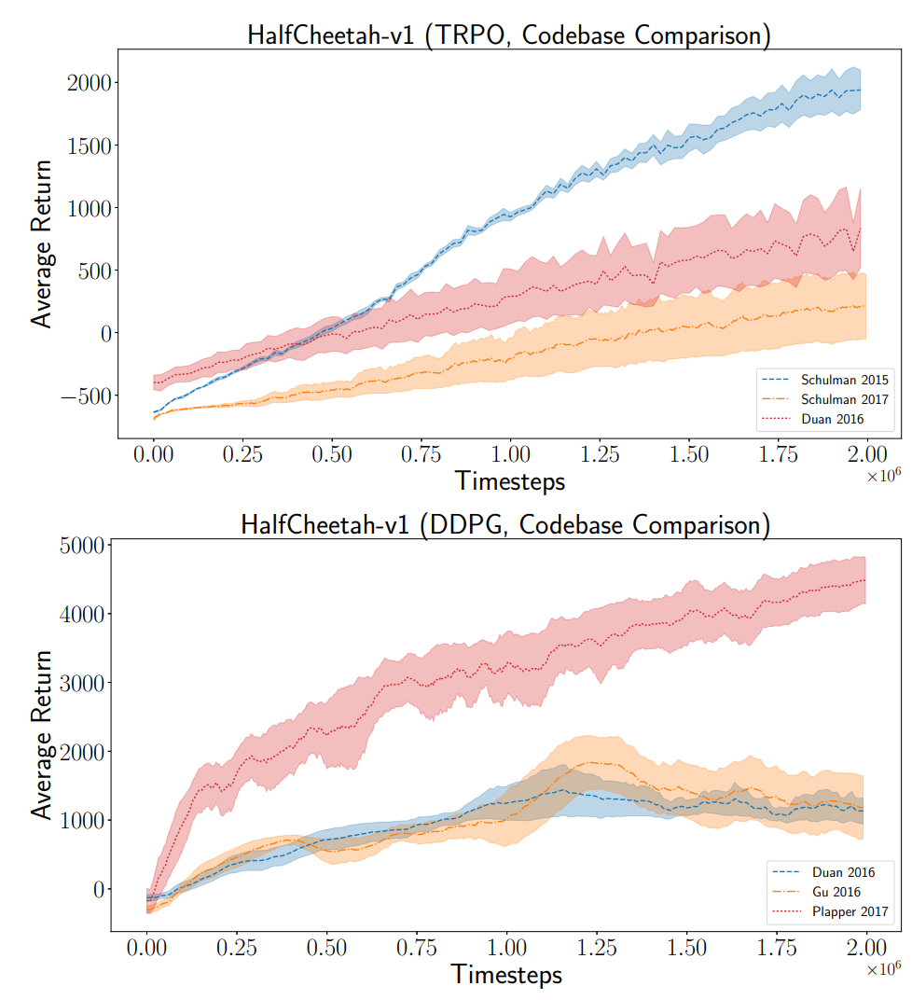
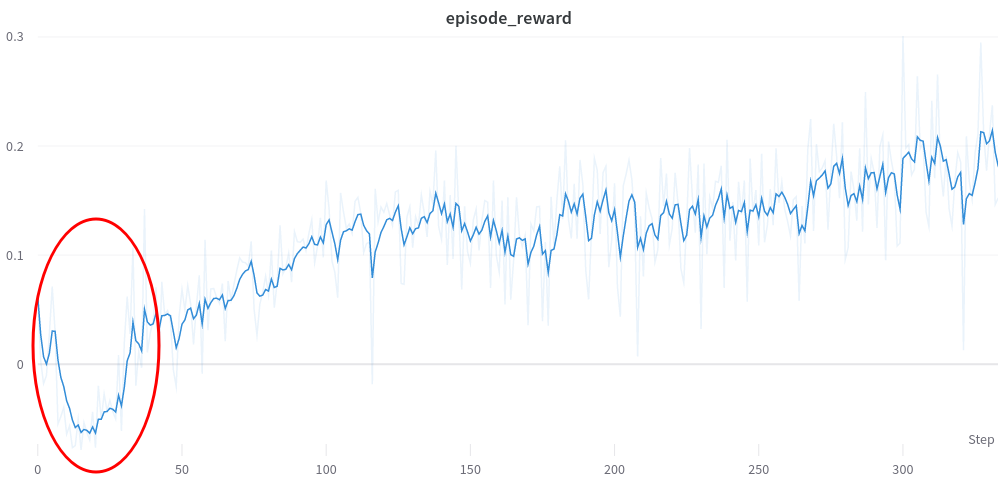

<!-- This article is not an introduction for reinforcement learning and assumes you know what it is and are trying to get into it. -->

Outline of this post
1. RL is a very exciting and promising field
2. BUT its hard to reproduce results and hard to apply to new fields
3. This blog post gives a list of tricks and lessons learned for beginners trying to write RL algorithms from scratch and/or apply RL algorithms to new tasks
<!--
The list of tricks -->
<!--
First of all, it is difficult to reproduce results in deep reinforcement learning ([Wired article](https://www.wired.com/story/artificial-intelligence-confronts-reproducibility-crisis/)). -->

<!-- Reinforcement Learning is a category in machine learning that doesn't quite fall under the scope of supervised or unsupervised learning -->

When I first started studying reinforcement learning (RL), I implemented [Proximal Policy Optimization](https://arxiv.org/abs/1707.06347) from scratch using only the [psuedocode](https://spinningup.openai.com/en/latest/algorithms/ppo.html#pseudocode) on OpenAI's website. It didn't work and failed to obtain nearly any reward on most OpenAI Gym environments. It took a few more months of debugging, reading other RL implementations, and talking to colleagues to get things working. My conversations with other Georgia Tech students revealed that initially struggling to do basic things with RL was not uncommon. [These](https://www.alexirpan.com/2018/02/14/rl-hard.html#:~:text=Often%2C%20it%20doesn't%2C,out%20of%20the%20RL%20algorithm.) blog [posts](https://andyljones.com/posts/rl-debugging.html) do a great job of explaining the difficulty with RL and really resonate with my own experiences.

<!-- Some of these "tricks" are will be obvious if you have experience in supervised learning, such as gradient clipping and input normalization.  -->

<!-- These are all things that are very important to getting this working, but are mundane enough that most of the time no one really tells you explicitly to make sure to do these things or they assume that you already know.  -->

<!-- Where possible, I have tried to include links to code in RL implementations where these tricks are found. I will additionally include a link to any help Pytorch functions for implementation. -->

In hindsight, there was no single major flaw with my initial PPO implementation, but rather many small tricks and optimizations that were missing. The purpose of this post is to enumerate these tricks and provide references to code where they are implemented. Some of these things you really only need to worry about if you decide to write an RL algorithm from scratch, as most implementations will already include them. However, knowing of their existence will enable you to debug more effictively and make changes more intelligently. They are roughly ordered in descending order of importance.

Different RL implementations will include a slightly different set of tricks. As evidence of their importance, check out this figure (below) from [Deep RL that matters](https://arxiv.org/pdf/1709.06560.pdf). The authors show empirically that different popular implementions of the same RL algorithm differ significantly in performance on standard RL benchmarks, even when controlling for hyperparameters and network architecture.

<!-- (They also expose a similar sensitivity to hyperparameters, network architecture, random seed, reward scale, and choice of environment -- RL is very finicky). -->

<!-- Different implementations include different sets of tricks -- and they really do make a difference. In -->

<!-- Through the entire process, I learned of a variety of small tricks and optimizations that are typically used to get RL algorithms working on complex environments. -->
<!-- I believe the different set of tricks included in each implementation is the primary cause of this inconsistency. Additionally, many of these tricks introduce their own hyperparameters. -->

<!-- Deep reinforcement learning (RL) is an exiciting area of study, but it can be difficult to [reproduce results](https://www.wired.com/story/artificial-intelligence-confronts-reproducibility-crisis/) in academic papers or successfully apply RL algorithms to new domains. Part of the issue is learning all the small tricks which are sometimes not disclosed and vary between impelemtations. -->

*Figure 6 from [Deep Reinforcement Learning that Matters](https://arxiv.org/pdf/1709.06560.pdf) plotting the performance of different RL implementations, averaged over 5 random seeds*

 <!-- When I started in 2020, I had been motivated by cool results [in](https://openai.com/blog/learning-dexterity/) [robotics](https://arxiv.org/pdf/1812.11103.pdf and [video games](https://arxiv.org/pdf/1312.5602). The generality and power of deep RL algorithms seemed very promising compared to the domain-specific trajectory optimization algorithms for robotic locomotion that I had been previously studying. -->

<!-- However, in doing RL research I quickly found that it was difficult to reproduce existing results or to apply RL to new tasks. -->

<!-- I began studying reinforcement learning (RL) in the summer of 2020, when I joined the [Robotics Perception and Learning Lab](https://faculty.cc.gatech.edu/~zk15/). I was motivated by the how powerful and general the algorithms seemed and the results in [video games](https://arxiv.org/pdf/1312.5602) and especially in [robotics](https://arxiv.org/pdf/1812.11103.pdf) [Shadow Hand](https://openai.com/blog/learning-dexterity/). -->

<!-- However, while it is trivial to clone a popular RL repository and train policies on existing benchmarks, implementing RL algorithms from scratch or succesfully applying RL to a new task or application domain is quite difficult. Reading academic papers and understand the theory behind why an algorithm works is an important part of research, but not enough for .

My issue was that even if I understood all the theory behind an RL algorithm, either from a paper or from Spinning Up, there were still many tricks required to get RL working in practice. To draw a parallel to supervised learning, it would be like understanding SGD and neural networks, but not having knowledge of batch norms or residual connections.

Altough PPO is a SOTA algorithm, implementing pseudocode directly from the PPO paper (below) will not yeild SOTA performance. You need all the other stuff. -->

Now for some disclaimers: Nearly all of my experience comes from training on-policy algorithms for continuous control, so there may be useful tips for discrete/off-policy settings that I am missing. Also, RL is a super-hot field, so perhaps some of the content in this post is already outdated. Hopefully, this blog is at least useful to someone starting out like I was. Please don't hesitate to reach out to me if you think there is something important missing!

Most of the examples will come from either of these two RL implementations of which I am familair with:
https://github.com/ikostrikov/pytorch-a2c-ppo-acktr-gail
https://github.com/Denys88/rl_games

<!-- I don't have ablation results on all of these. -->

<!-- ### Using an existing RL Implementation and environment -->

Implementing an RL algorithm from scratch is an excellent way to learn. However, if you need to get something working quickly, you should instead just fork a popular repo. Here are some suggestions:

- [Stable Baselines3](https://stable-baselines3.readthedocs.io/en/master/)
- [RL Games](https://github.com/Denys88/rl_games)
- [pytorch-a2c-ppo-acktr](https://github.com/ikostrikov/pytorch-a2c-ppo-acktr-gail)
- [RLlib](https://docs.ray.io/en/latest/rllib/index.html)
<!-- This is the main thing you should do instead of trying to code one from scratch. Take an existing implementation, play around with it, run some benchmarks. Then make a fork and start modifying the implementation for your own project. They will include their own set of tricks, and the creators have likely already tuned it a lot on RL benchmarks and provide default hyperparameter values that work decently well. -->

Thanks to Elon Musk for helping me proofread and edit this post.

TODO post this on the RL discord.

Contents
- [Observation and Normalization Clipping](#observation-normalization-and-clipping)
- [Dense Rewards](#dense-rewards)
- [Gradient Normalization and Clipping](#gradient-normalization-and-clipping)

### Observation Normalization and Clipping

In RL, the inputs to the policy and value networks are observations, which can consist of values that differ by orders of magnitude. For example, if you are learning a policy to control a robot, your observation could contain joint angles ranging from $ -\frac{\pi}{2} $ to $ \frac{\pi}{2} $ radians and a robot position coordinate that lies between 0 and 1000 meters. Normalizing the input space to eliminate this difference in scale leads to more stable training and faster convergence. This should be nothing new to those with prior experience training neural networks.

The two most common methods for preprocessing are standardization and rescaling. Standardization refers to subtracting the mean and dividing by the standard deviation of the data so that each dimension approximates a standard normal distribution. Rescaling refers to mapping the data to the range $ \left[0, 1\right] $ by subtacting the min and dividing by the range.

In supervised learning, statistics calculated over the training set are used to normalize each sample. In RL, this isn't possible because the dataset (consisting of interactions with the environment) is collected online and the statistics change continuously. Because of this, you need to calculate an online mean and standard deviation. Most RL codebases use an implementation of [Welford's Online Algorithm](https://en.wikipedia.org/wiki/Algorithms_for_calculating_variance#Welford's_online_algorithm) like [this one](https://github.com/DLR-RM/stable-baselines3/blob/master/stable_baselines3/common/running_mean_std.py) from Stable Baselines3.

This online approach is best when your algorithm needs to work on many different environments. Typically, this style of input normalization causes an initial drop in performance as the mean and standard deviation move very early in training due a small sample size and rapid exploration.

<!-- Do this because optimization is much more effective when the different inputs are all the same scale, speeds up learning, and leads to faster convergence. Also avoid clipping to get rid of random or unexpected outliers, and because neural networks are bad at extrapolating. -->

Alternatively, if you have good prior knowledge about the observations space, you can just rescale your data to the range [-1, 1] or [0, 1], like what they do [here](https://github.com/leggedrobotics/legged_gym/blob/dd6a6892e54c4f111a203319c05da8dca9595ae1/legged_gym/envs/base/legged_robot.py#L212).

<!-- That way you avoid computing an online mean and the warmup period. This may also be more stable wrt random seed, get out of local minima easier -->

<!-- Neural networks like nice smooth inputs and outputs. -->
**Note:** A common bug when replaying trained policies is the failure to save and load normalization statistics. A policy network will not work during test time if the inputs are not preprocessed the same way they were during training.

Code examples
- https://github.com/Denys88/rl_games/blob/06a3319d3a6af566d984aa5953b1fd7a24a8e3a4/rl_games/common/a2c_common.py#L587
- https://github.com/Denys88/rl_games/blob/94e55563be60f10e659428cdce7b4e0bd131d471/rl_games/algos_torch/models.py#L41

<!-- ### Simplify the action space and add prior knowedge
PMTG, foot position instead of joints to avoid learning IK, make the outputs just deltas to a expert policy
 -->

### Dense Rewards

(dense = every timestep, smooth = varies smoothly between regions of the state space (ie gradual change vs large steps))

This tip will only be applicable if you are applying RL to a new task where you have the freedom to specify a reward function, rather than training on standard RL benchmarks where the reward function is part of the task.

Sparse rewards are difficult for RL algorithms to learn from. If possible, try making your reward *dense*, meaning that at every timestep the agent recieves an informantive reward as a function of the current state, previous state, and action taken by the policy. For example, instead of rewarding an agent +1.0 for reaching a goal and 0.0 otherwise, try giving a reward at every timestep that is propotional to progress towards the goal. Of course, this requires some prior knowledge of what progress looks like and can limit what your policy discovers accordingly.

For example, in the paper [ALLSTEPS: Curriculum-driven Learning of Stepping Stone Skills
](https://arxiv.org/abs/2005.04323), the authors train a bipedal robot to hit a series of stepping stones. A naive reward design would give +1.0 if the robot's foot hit the center of the foot target, and 0.0 otherwise. Instead of doing this, the authors specify a reward function of

$$ r_{target} = k_{target}exp(-d/k_d) $$

where d is the distance from the foot to the target, and $ k_{target}$ and $k_d$ are hyperparameters. The authors explain:

>In the initial stages of training, when the character makes contact with the target, the contact location may be far away from the center. Consequently, the gradient with respect to the target reward is large due to the exponential, which encourages the policy to move the foot closer to the center in the subsequent training iterations.

Additionally, the authors reward robot center-of-mass velocity towards the next footsteps which further provides a progress signal.

### Gradient Normalization and Clipping
This is another one that could be obvious if you have a background in supervised learning. Normalizing the gradient of the value and policy networks after each backward pass can help avoid numerical overflow, exploding gradients, or destructively large parameter updates. Other tricks for avoiding these same issues include rewarding normalization and clipping, value function loss clipping, and advantage standardization.

Code examples:
- https://github.com/Denys88/rl_games/blob/8da6852f72bdbe867bf12f792b00df944b419c43/rl_games/common/a2c_common.py#L252
- [torch.nn.utils.clip_grad_norm_](https://pytorch.org/docs/stable/generated/torch.nn.utils.clip_grad_norm_.html)
- [torch.nn.utils.clip_grad_value_](https://pytorch.org/docs/stable/generated/torch.nn.utils.clip_grad_value_.html)

### Reward Normalization and Clipping
Typically, it is best not to have reward values that differ by many orders of magnitude. For example, in the paper [Playing Atari with Deep Reinforcement Learning](https://www.cs.toronto.edu/~vmnih/docs/dqn.pdf), the authors clip all rewards to the range $ \left[-1, 1\right] $.

>Since the scale of scores varies greatly from game to game, we fixed all positive rewards to be 1 and all negative rewards to be −1, leaving 0 rewards unchanged. Clipping the rewards in this manner limits the scale of the error derivatives and makes it easier to use the same learning rate across multiple games. At the same time, it could affect the performance of our agent since it cannot differentiate between rewards of different magnitude.
 
>-- <cite>Mnih, Volodymyr, Koray Kavukcuoglu, David Silver, Alex Graves, Ioannis Antonoglou, Daan Wierstra, and Martin Riedmiller. "Playing atari with deep reinforcement learning." arXiv preprint arXiv:1312.5602 (2013).</cite>

In addition to just clipping the rewards, you can also keep a running mean and standard deviations of rewards to standardize rewards or returns (discounted rewards).

### Advantage Standardization
Before calculating a loss for the policy network, advantages are computed and then standardized, such that about half of the advantages are positive and about half are negative. This is done for stability of training and variance reduction. Here is an excert from [HW2](http://rail.eecs.berkeley.edu/deeprlcourse-fa17/f17docs/hw2_final.pdf) of the Berkely Deep RL course:

>A trick which is known to usually boost empirical performance by lowering variance of the
estimator is to center advantages and normalize them to have mean of 0 and a standard
deviation of 1.
From a theoretical perspective, this does two things:
>- Makes use of a constant baseline at all timesteps for all trajectories, which does not
change the policy gradient in expectation.
>- Rescales the learning rate by a factor of 1/σ, where σ is the standard dev of the
empirical advantages.

Code Examples
- https://github.com/ikostrikov/pytorch-a2c-ppo-acktr-gail/blob/41332b78dfb50321c29bade65f9d244387f68a60/a2c_ppo_acktr/algo/ppo.py#L36

### Hyperparameter Tuning
RL is notoriously sensitive to hyperparameters and there is no one-size-fits all for good hyperparameter values. Typically, different implementations and different applications will need different hyperparameters. This is a major complaint about RL.

The good thing is, [Weights & Biases](https://wandb.ai/site) has a very good pipeline for doing automated, distributed hyperparameter sweeps. They support random search, grid search, and Bayesian search.
[Check it out.](https://docs.wandb.ai/guides/sweeps)

### Value Network Loss Clipping
This is another trick aimed at controlling the behavior. The mean-squared error loss that the value function is trained on is clipped from [-k, k] where k is usually around 0.2.

Code Examples:
- https://github.com/Denys88/rl_games/blob/8da6852f72bdbe867bf12f792b00df944b419c43/rl_games/common/common_losses.py#L7
- https://github.com/ikostrikov/pytorch-a2c-ppo-acktr-gail/blob/41332b78dfb50321c29bade65f9d244387f68a60/a2c_ppo_acktr/algo/ppo.py#L68

<!-- ### PPO loss -->
<!-- ### shared actor-critic layers -->

### Learning Rate Scheduling
A commong thing is to implement a linearly decreasing learning rate throughout training. The idea is that towards the end of training, you want to avoid making descrutively large policy updates (this is also the idea behind TRPO and allocating your retirement savings into bonds as you grow older.) and your performance will have mostly saturated so you should just be fine-tuning your policy.

A fancier way to do this is to adaptively set the learning rate based on a desired [KL-divergence](https://en.wikipedia.org/wiki/Kullback%E2%80%93Leibler_divergence) between something. I have mostly used this for my work with the quadruped, set the initial learning rate to 1e-5 and then let the adaptive lr take over. Here is what the lr plot usually looks like.

This shows five training runs for my [quadruped project](https://www.jeremiahcoholich.com/publication/quadruped_footsteps/). The desired KL-divergence was set to 0.01. The lr usually hovers around 7e-4.

Code examples for linear lr decay:
- https://github.com/ikostrikov/pytorch-a2c-ppo-acktr-gail/blob/efc71f600a2dca38e188f18ca85b654b37efd9d2/a2c_ppo_acktr/utils.py#L46
- https://pytorch.org/docs/stable/generated/torch.optim.lr_scheduler.StepLR.html

Code for adaptive lr:
- https://github.com/Denys88/rl_games/blob/50d9a460f8ba41de5dbac4abed04f8de9b849f4f/rl_games/common/schedulers.py#L19

<!-- ### ADAM optimizer -->

### bootstrapping good terminations
I have found that this is not stricly necessary (afaik, the rl_games library does without it) and can sometimes hurt (excess bootstrapping can sometimes hurt, which is a hypothesized reason that DQN and td-learning doesn't do that well). The returns will be the same in expectation, but suffer from higher variance.

This idea is this

$$ e^{i \pi}$$

I believe this is more necessary as your number of samples per update decreases.

### Generalized Advantage Estimation
I have found GAE is useful in improving performance. Its just another knob to turn. In most training runs, I set gamma to 0.99 and lambda = 0.95. The lambda parameters can be though of as a factor used control the amount of bootstrapping. 0 is no bootstrapping, where 1 is td-learning (lots of bootstrapping). As you increase the number of samples per iteration, you will perform better with lambda set to 1.

https://github.com/ikostrikov/pytorch-a2c-ppo-acktr-gail/blob/efc71f600a2dca38e188f18ca85b654b37efd9d2/a2c_ppo_acktr/storage.py#L73

### Entropy Decay
The idea is simple: in the beginning you want more exploration. Towards the end you want more exploitation. This can help your agent avoid local optima early in training.
In on-policy algorithms like TRPO and PPO, you have an entropy coeffient in the loss function for your policy net. You can just decrease this entropy coefficient. In off policy algorithms like DDPG, SAC, or TD3, you have exploration during data collection and you can just decrease the variance of the distribution of the noise you add to policy output for exploration.

Actually, I have often found this is uncessary, and don't really use it. For my work in legged locomotion, I found that an entropy coeffient of 0 works best (perhaps because the dynamics are chaotic enough that extra exploratio noise is not necesary.)

Thanks for reading!
